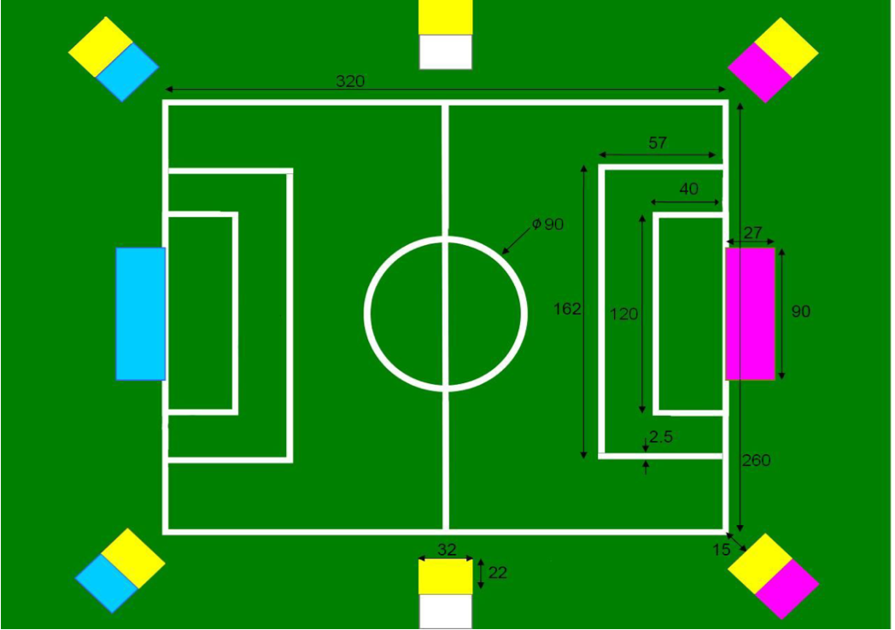
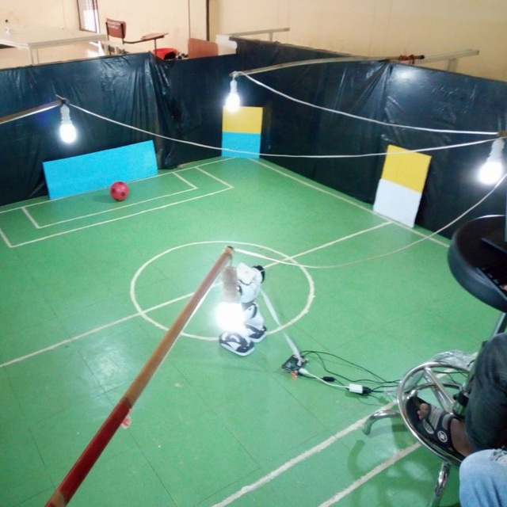
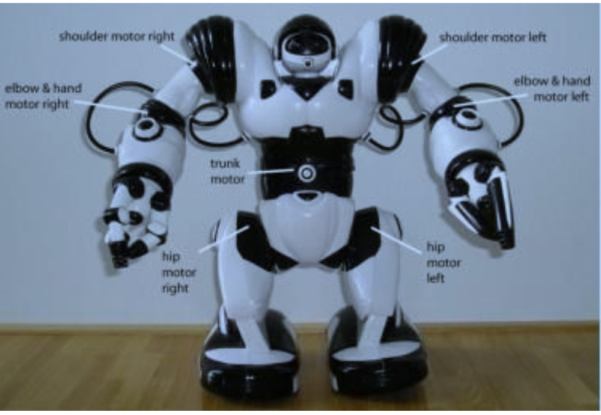

# Robosoccer

This project is an extension of the code available at [https://github.com/elggem/soccercode.git](https://github.com/elggem/soccercode.git), focusing on enabling Robosapien robots to play soccer. The code is specifically designed for execution on a Raspberry Pi.

The soccer field used in the game is depicted in the accompanying image. To score a goal, the robot is required to dribble the ball and hit the marker of the goal. The project is divided into five key modules: picamera, blob detector, blob mapping, sensor, and body driver. Each of these modules functions as a ROS node, and communication between them is facilitated through the publishing and subscribing of topics associated with these nodes.

 

## Outline

  - [X] Raspberry Pi Video capture node ('raspicam', C++, modified a bit from https://github.com/fpasteau/raspicam_node)
  - [X] blob_detector node for detecting blobs from a list of colors ('blob_detector', Python)
    - looks for a areas of colors from a list of HSV color ranges
    - publishes the name, location and sizes of the top ten biggest blobs.

  - [X] Preprocessing node (`blob_mapping`, Python)
    - subscribes to topic from blob_detector
    - converts x/y value and area messages then 
      maps them to real space (angle from robot and distance)
    - it also tries to find markers by checking pairs of colors
    - observed markers are compiled together and published for robot_localization.
  - [X] Sensor 
    - this is where the orientation of the the robots is detected.
    - publishes to the body_driver topic
          
  - [X] Body driver
    - It where the acutal action of the robot is done.
    - subscribes to the blob_detector and blob_mapping.
## Dependencies
- python2.7
- rospy
- OpenCV
- numpy

## Launch

See src/launchers launch files.
