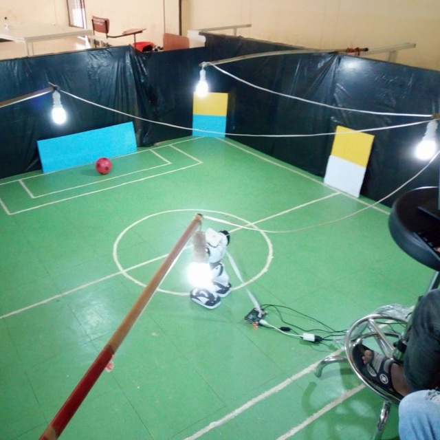

# Robosoccer
This code is a modification from [https://github.com/elggem/soccercode.git](https://github.com/elggem/soccercode.git). It is all about playing Robosapien robots a soccer. The code is written to be run on a Raspberry pi. The field of the game is shown in the following picture. To score a goal the robot has to dribble the ball and hit the marker of the goal. This has done in five modules. These five modules are picamera, blob detector, blob mapping, sensor, and body driver. Each of these modules have a ROS node and the commucation between them is done through publishing and subscribing to the topics of these nodes. 
 

## Outline

  - [X] Raspberry Pi Video capture node ('raspicam', C++, modified a bit from https://github.com/fpasteau/raspicam_node)
  - [X] blob_detector node for detecting blobs from a list of colors ('blob_detector', Python)
    - looks for a areas of colors from a list of HSV color ranges
    - publishes the name, location and sizes of the top ten biggest blobs.

  - [X] Preprocessing node (`blob_mapping`, Python)
    - subscribes to topic from blob_detector
    - converts x/y value and area messages then 
      maps them to real space (angle from robot and distance)
    - it also tries to find markers by checking pairs of colors
    - observed markers are compiled together and published for robot_localization.
  - [X] Sensor 
    - this is where the oriention of the the robots is detected.
    - publishes to the body_driver topic
          
  - [X] Body driver
    - It where the acutal action of the robot is done.
    - It subsribes to the blob_detector and blob_mapping.
## Dependencies
- python2.7
- rospy
- OpenCV
- numpy

## Launch

See src/launchers launch files.
